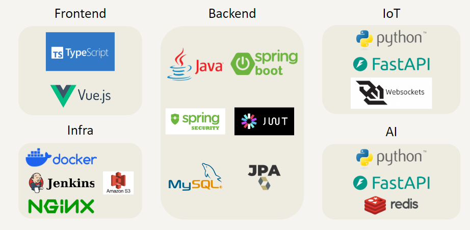
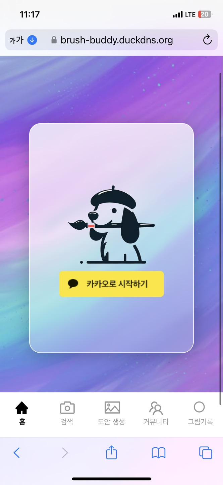
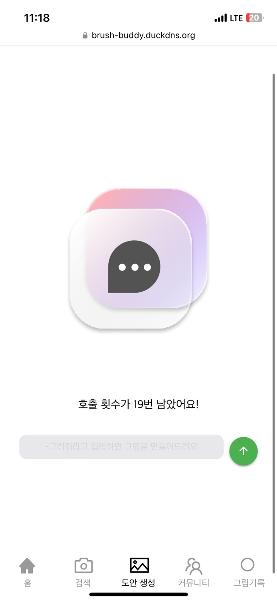
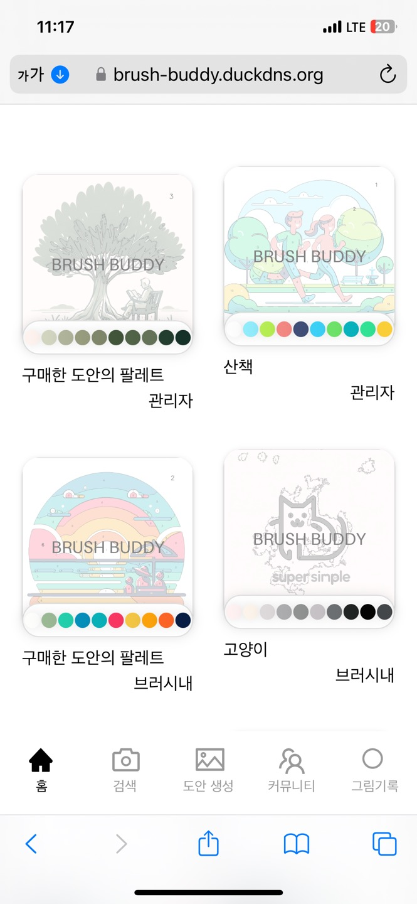
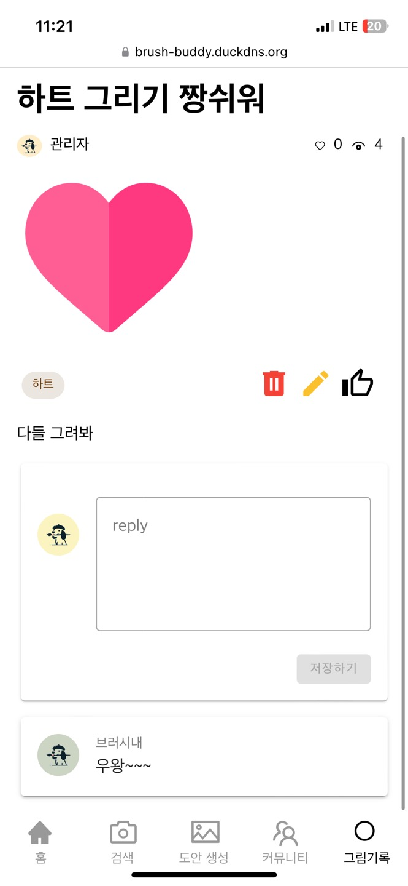
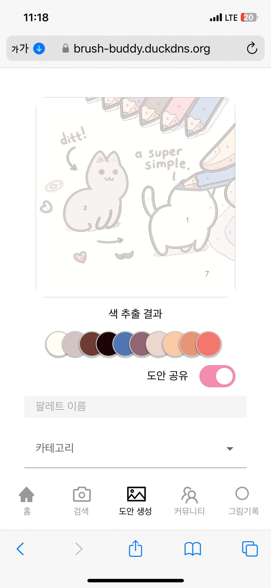
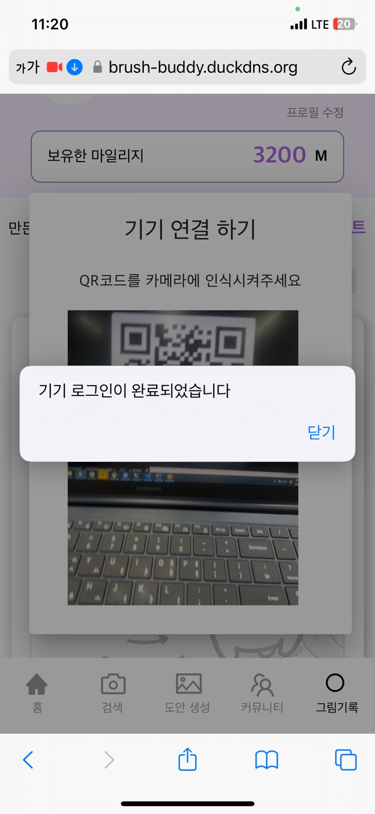
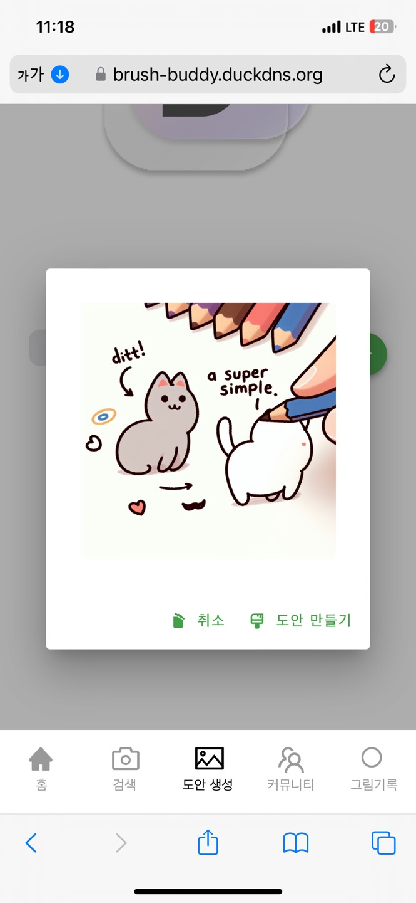

# Brush Buddy -

### 프로젝트 진행 기간

2023.01.09(월) ~ 2023.02.16(금)

## Team Members

  <table>
    <tr>
        <td align="center">
        
      </td>
      <td align="center">
        
      </td>
      <td align="center">
        
      </td>
      <td align="center">
        
      </td>
      <td align="center">
        
      </td>
      <td align="center">
        
      </td>
    </tr>
    <tr>
      <td align="center">
        <a href="">
         김영진
        </a>
      </td>
      <td align="center">
        <a href="https://github.com/">
          백승윤
        </a>
      </td>
      <td align="center">
        <a href="https://github.com/">
          용희원
        </a>
      </td>
      <td align="center">
        <a href="https://github.com/">
          이상협
        </a>
      </td>
      <td align="center">
        <a href="https://github.com/">
          이신애
        </a>
      </td>
      <td align="center">
        <a href="https://github.com/">
          전소민
        </a>
      </td>
    </tr>
  </table>

## 👓 등장 배경

####

## 개요

## Usage

### 개발환경

## Service Architecture

### 📂디렉토리 구조

  

  백엔드 디렉토리 구조
  

  
 

  

  프론트엔드 디렉토리 구조
  

    ├── App.vue
    ├── api
    │   ├── axios.ts
    │   ├── board.ts
    │   ├── draft.ts
    │   ├── machine.ts
    │   ├── palette.ts
    │   ├── type.ts
    │   └── user.ts
    ├── assets
    │   ├── background.png
    │   ├── icon
    │   ├── images
    │   ├── kakao.png
    │   └── logo.png
    ├── components
    │   ├── Community
    │   ├── CommunityComponent.vue
    │   ├── Diary
    │   ├── Draft
    │   ├── DraftDetail
    │   ├── NavigationComponent.vue
    │   ├── Palette
    │   ├── Pay
    │   ├── Search
    │   ├── SearchComponent.vue
    │   └── common
    ├── main.ts
    ├── router
    │   └── index.ts
    ├── stores
    │   ├── boardlike.ts
    │   ├── bookmark.ts
    │   ├── counter.ts
    │   ├── image.ts
    │   ├── menutypes.ts
    │   ├── pay.ts
    │   └── user.ts
    ├── views
    │   ├── CommunityBoardListView.vue
    │   ├── CommunityDetailView.vue
    │   ├── CommunityModifyView.vue
    │   ├── DiaryView.vue
    │   ├── DraftCreateAIView.vue
    │   ├── DraftDetailView.vue
    │   ├── DraftPipoMakeView.vue
    │   ├── DraftView.vue
    │   ├── DraftWrite.vue
    │   ├── HomeListView.vue
    │   ├── HomeView.vue
    │   ├── LoginView.vue
    │   ├── PaletteDetailView.vue
    │   ├── SearchView.vue
    │   ├── payCharge.vue
    │   └── payView.vue
    └── vite-env.d.ts

## 주요기능 및 화면

